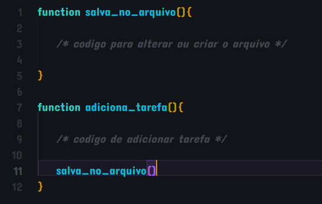
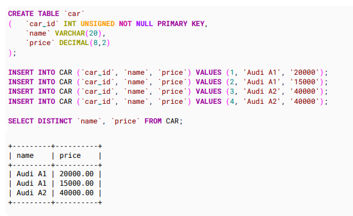
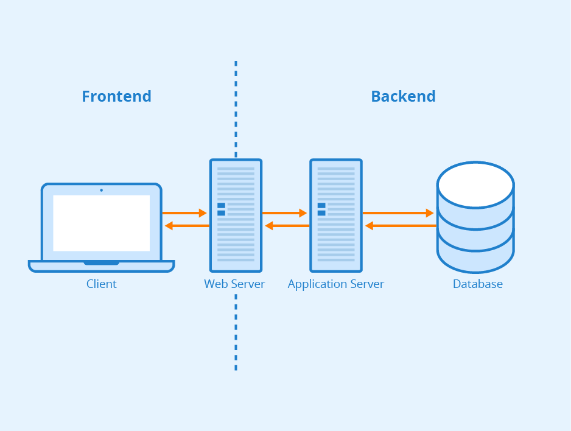

# Roadmap para chegar pelo menos no mesmo level que eu kkkkk

## - **Backend (usando Nodejs)**

* **Fazer lista de [exercicio de logica de programação](https://www.google.com/url?sa=t&rct=j&q=&esrc=s&source=web&cd=&ved=2ahUKEwif3-uwluz6AhU6_rsIHdMrATQQFnoECAoQAQ&url=https%3A%2F%2Fads.ifba.edu.br%2Fdl1012&usg=AOvVaw2G6gRZqERxw6Z4Hff7240o) ate entender a sintaxe do javascript (nao precisa fazer todos, só ate lembrar como faz os codigo abaixo). [Pdf com quase tudo de javascript](https://books.goalkicker.com/JavaScriptBook/)**
    * string, numeros, arrays. objetos
    * if else
    * loops (for, foreach, map, filter, reduce)
    * funções (parametros e retornos)

* **Fazer um programa (To-do list).**
    * o programa vai ter user e admin
    * um menu diferente para cada um

          

    * os users tem fazer registro e login (só pode ter um username e id pra cada um)

         

    * o user pode fazer um **CRUD** de tarefas (criar, editar, excluir e visualizar)

         

    * cada user quando logar só pode ver as tarefas que ele mesmo criou
    * um admin pode ver as tarefas de todos os users
    * um admin pode fazer o **CRUD** de qualquer user e qualquer tarefa
    * só um admin pode criar outros admins

* **Guardar informação em arquivo**
    * aprender mexer com a bliblioteca fs (filestream)
    * refazer o programa to-do list mas agora toda a informacao vai ser guardada em um arquivo .txt
    * criar uma função que sempre que alguma coisa for adicionada ou alterada no programa vai salvar toda a informaçao do programa (users, ids, tarefas)

        

    * criar uma logica para ler esse arquivo quando o programa inicia e colocar a informaçao num array
    * exemplo de um arquivo .txt

        

* **Aprender um pouco sobre base de dados**
    * saber fazer um diagrama de classes porque isso ajuda muito antes de criar qualquer programa
    * exemplo de um diagrama de classe do to-do list:

        

    * baixar o mysql e workbench
    * [pdf bom com muita coisa de mysql](https://goalkicker.com/MySQLBook/MySQLNotesForProfessionals.pdf)
    * criar uma base da dados e criar as tabelas da BD
    * cada tabela vai ser uma classe do print de cima
    * treinar fazer insert (adicionar informação nas tabelas da BD)
    * treinar fazer select (pegar informação da BD)
    * treinar fazer updates e deletes (deletar e atualizar informação na BD)
    * exemplos aleatorios:

        

* **Refazer o programa to-do list mas agora sem guardar a informação em arquivo e sim na Base de Dados**
    * durante essa parte vai começar usar coisas mais avançadas de javascript. é só ir estudando quando for precisando:
        * javacript assincrono
        * promises
        * async - await
        * try-catch
 
    * novo to-do list:
        * usa a base da dados que criou no ponto anterior
        * agora pode começar a usar classes. Cada tabela da base da dados sera uma classe no programa javascript, assim o codigo fica mais organizado e inteligente
        * aprender a mexer com a biblioteca mysql no nodejs
        * criar uma função que liga o codigo javascript na base de dados, exemplo:

            

        * agora em vez de toda vez que um CRUD for feito, nao vai ter mais a funcao de atualizar o arquivo mas sim de atualizar a BD
        * isso vai ser feito usando coisas que aprendeu no ponto anterior (inserts, selects, updates e deletes), exemplo:

            

* **Criar um servidor**
    * introdução
        * de novo no to-do list mas agora a diferença que vai ser um servidor rodando a espera de requests(informaçao vinda de um cliente do front end)
        * nao vai ter mais menu e nao vai ter mais inputs inseridos na linha de comando
        * como funcionam quase todos programas do mundo:

            

        * toda informação que é passada de um lado pro outro (front pro back e vice versa) é em formato json
    * pratica
        * [pdf bom para ajudar](https://goalkicker.com/NodeJSBook/NodeJSNotesForProfessionals.pdf)
        * aprender mexer com a biblioteca express no nodejs
        * baixar o programa postman (simula as infmaçoes enviadas do front pro back ja que nao tem front ainda)
        * criar função que ficam esperando info vinda do front (ou postman em formato json)  depois processa e depois manda pra BD e vice versa

* **Treinar fazer servidores diferentes mas em projetos diferentes do to-do list**
    * ver a pasta de enunciados

* **Estudar coisas mais avançadas de servidor como fazer autenticação, tokens e cookies**

## - **Frontend**
* **Html e Css**
    * ver uns video no youtube de html e css basico, nao tem outro jeito
    * html
        * [pdf com coisas de html](https://goalkicker.com/HTML5Book/HTML5NotesForProfessionals.pdf)
        * tags mais importantes (p, h, a, input, button, div, form)
    *  css
       * [pdf com coisas de css](https://goalkicker.com/CSSBook/CSSNotesForProfessionals.pdf)
       *  aprender bem principalmente flex e grid
    * formar de treinar
        * criar paginas simples de login e criar conta
        * entrar no site figma e pesquisar telas sites para tentar replicar
        * tentar clonar sites
* **Fazer todos os menus do to-do list mas agora no front com html e css**
    * criar uma pasta com um arquivo index.html, style.css e index.js
    * fazer os menus com html e css
    * usar o arquivo javascript para pegar e processar os inputs inseridos no html pelos usuarios
    * fazer um fetch (consumir as urls do backend) para envias as informaçoes pro backend e depois pra base dados
    * fazer um fetch para pegar a informaçao das tarefas do backend e fazer aparecer na tela em forma de tabela (linhas e colunas)

* **Escolher uma grande Framework de frontend para ficar bom (ReactJs, Angular ou Vue)**